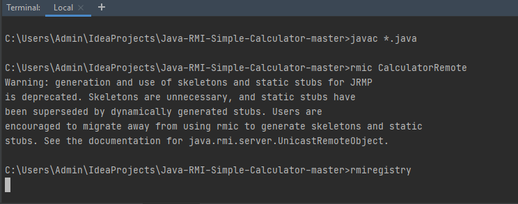
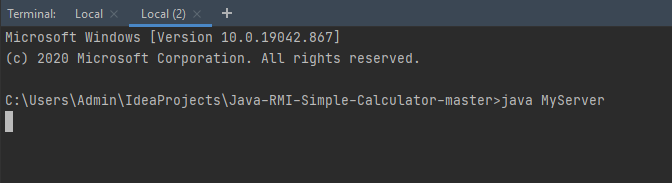
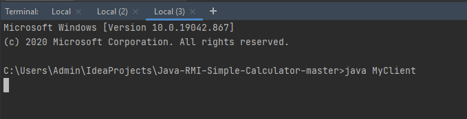

# Java-RMI-Calculator

This is the implementation of simple calculator using Java RMI.

### Steps for running the project:

1. Open the terminal in the project directory.
2. Run javac \*.java
3. Run rmic CalculatorRemote
4. Run rmiregistry (you can specify the port here, e.g. rmiregistry 5001, otherwise default port 1099 will be used)
5. Open two more terminals in same directory.
6. Run java MyServer in one terminal (or java MyServer 5001).
7. Run java MyClient in other terminal (or java MyClient 5001).

### Snapshots

